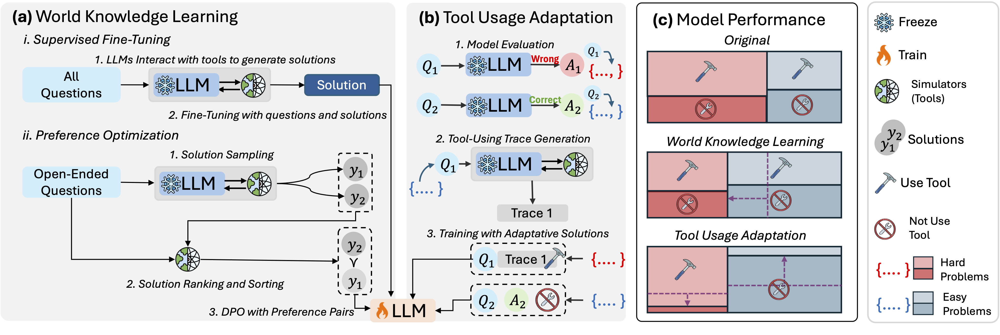

# Adapting While Learning: Grounding LLMs for Scientific Problems with Tool Usage Adaptation

Code for paper "Adapting While Learning: Grounding LLMs for Scientific Problems with Tool Usage Adaptation", presented at ICML2025.

## Abstract

Large Language Models (LLMs) demonstrate promising capabilities in solving simple scientific problems but, even with domain-specific fine-tuning, often produce hallucinations for complex ones. While integrating LLMs with tools can mitigate this reliability issue, models finetuned on tool usage only often over-rely on them, incurring unnecessary costs from resource-intensive scientific tools even for simpler problems.
Inspired by how human experts assess the complexity of the problem before choosing the solutions, we propose a novel two-component fine-tuning method, AWL (Adapting while Learning). In the first component World Knowledge Learning (WKL), LLMs internalize scientific knowledge by learning from tools-generated solutions. In the second component Tool Usage Adaptation (TUA), we classify questions as easy or hard based on the model's accuracy, and train it to maintain direct reasoning for simple problems while switching to tools for challenging ones.
We validate our method on 6 scientific benchmark datasets in climate science, epidemiology, physics, etc. Compared to the base 8B model, our trained models achieve 29.11\% higher answer accuracy and 12.72\% better tool usage accuracy, even surpassing state-of-the-art models including GPT-4o and Claude-3.5 on 4 custom-created datasets.

## Installation

To set up the environment, you'll need Python 3.9 and the required dependencies. You can create the environment and install the required packages using the following commands:

```bash
conda create -n awl python=3.9.19
conda activate awl
pip install -r requirements.txt
```

The emulators used in climate and epidemiology scenarios are respectively adapted from [MFRNP](https://github.com/Rose-STL-Lab/MFRNP) and [INP](https://github.com/Rose-STL-Lab/Interactive-Neural-Process). You can download the pre-trained surrogate neural nets from [this link](https://drive.google.com/drive/folders/1Q-KwQnrxME3txfut0sGgbiRhJy9PCWPp?usp=share_link), and put the tools for climate and epidemiology respectively under `src/Climate` and `src/Epidemiology`. Note that the device of the climate emulator is configured in `src/Climate/tools/Climate_online/model/tas_reanalysis.yaml`.

The tool-calling in this work is achieved through Llama-3.1-8B-Instruct's [chat template](https://huggingface.co/docs/transformers/main/chat_templating), except open problems in Epidemiology. It means that, if you are using a model whose chat template doesn't support tool usage, then currect pipeline might can't be applied directly.

## Data Preparation



The workflow for training and evaluating the model, as illustrated in the paper and above figure, includes the following steps:

1. LLMs interact with external tools to solve scientific problems
2. Based on the interaction with tools, a solution is generated.
3. The LLMs are evaluated on the questions to categorize the dataset into easy and hard problems.
4. The World Knowledge Learning (WKL) and Tool Usage Adaptation (TUA) data are combined to further train the model.

Each sub-folder in the repository corresponds to a dataset, and each sub-folder contains scripts that execute these components in sequence.

```bash
# Generate a set of problems for training and testing.
python make_problems.py

# Use an LLM-Agent to answer the generated questions.
python answer_agent.py

# Generate solutions for the questions
python generate_solution.py

# Create training data based on the input file and model
python generate_training_data.py

# Generate answers using the LLM for the given input questions.
python answer_llm.py
```

Additionally, the Climate and Epidemiology folders include code related to open-ended questions.

## Training

We use [Llama-Factory](https://github.com/hiyouga/LLaMA-Factory) for both SFT and DPO training. You should firstly setup the environment of Llama-Factory. **The 'mixed' loss in the paper is realized through mixing training data, which is implemented in the `generate_training_data.py` files under each folder. We mixed the data of different problem difficulty (use or not use tools when tools are available, Eq. 5) and of different scenarios (whether tools are available, Eq. 6).**

The generate training data scripts provided in our repository directly generate the training data which matches the format of Llama-Factory. To use the data, you should firstly register the data to at `LLaMA-Factory/data/dataset_info.json`. For example, you can register the data for training the model on the climate dataset by adding the following entry to the file:

```python
"climate_train_1": {
    "file_name": "/path/to/climate_train_1.json",
    "formatting": "sharegpt",
    "columns": {
      "messages": "messages"
    },
    "tags": {
      "role_tag": "role",
      "content_tag": "content",
      "user_tag": "user",
      "assistant_tag": "assistant",
      "system_tag": "system"
    }
}
```

Then you can use LlaMA-Factory to train the model with:

```bash
llamafactory-cli train \
    --model_name_or_path meta-llama/Llama-3.1-8B-Instruct \
    --stage sft \
    --do_train true \
    --finetuning_type full \
    --deepspeed examples/deepspeed/ds_z3_offload_config.json \
    --dataset climate_train_1 \
    --template llama3 \
    --cutoff_len 5000 \
    --max_samples 100000000 \
    --overwrite_cache true \
    --preprocessing_num_workers 128 \
    --output_dir llama3_climate_1 \
    --logging_steps 10 \
    --save_steps 100 \
    --plot_loss true \
    --overwrite_output_dir true \
    --per_device_train_batch_size 1 \
    --gradient_accumulation_steps 16 \
    --learning_rate 1.0e-5 \
    --num_train_epochs 2.0 \
    --lr_scheduler_type cosine \
    --warmup_ratio 0.1 \
    --bf16 true \
    --ddp_timeout 180000000 \
    --val_size 0.0001 \
    --per_device_eval_batch_size 1 \
    --eval_strategy steps \
    --eval_steps 500 \
    --save_only_model true
```

## Evaluation

We provide the testing data in the `test_set` folder. For Questions with definite answers we provide standard answers along with the questions. For open-ended questions, we provide corresponding evaluation scripts (`Climate/evaluate_open.py` and `Epidemiology/eval_open.py`).

## Models

The following are reproduced models for MCQs on Climate and Epidemiology datasets:

| Dataset | Download |
| -------- | -------- |
|    Climate    |   [🤗Download](https://huggingface.co/Bohan22/AWL_Climate_MCQs)    |
|    Epidemiology    |   [🤗Download](https://huggingface.co/Bohan22/AWL_Epidemiology_MCQs)    |

We provide you with the training data for the climate model to easily reproduce the result. You can download the training data from [here](https://drive.google.com/drive/folders/1Nm5fRzcivug5hyV6CgjFQ677JNdkFff1?usp=share_link), register the data in Llamafactory like:

```python
"climate_mcq_stage1": {
    "file_name": "/path/to/climate_mcq_stage1.json",
    "formatting": "sharegpt",
    "columns": {
      "messages": "messages"
    },
    "tags": {
      "role_tag": "role",
      "content_tag": "content",
      "user_tag": "user",
      "assistant_tag": "assistant",
      "system_tag": "system"
    }
},
"climate_mcq_stage2": {
    "file_name": "/path/to/climate_mcq_stage2.json",
    "formatting": "sharegpt",
    "columns": {
      "messages": "messages"
    },
    "tags": {
      "role_tag": "role",
      "content_tag": "content",
      "user_tag": "user",
      "assistant_tag": "assistant",
      "system_tag": "system"
    }
}
```

Then train the final model with:

```bash
llamafactory-cli train \
    --model_name_or_path meta-llama/Llama-3.1-8B-Instruct \
    --stage sft \
    --do_train true \
    --finetuning_type full \
    --deepspeed examples/deepspeed/ds_z3_offload_config.json \
    --dataset climate_mcq_stage1 \
    --template llama3 \
    --cutoff_len 5000 \
    --max_samples 100000000 \
    --overwrite_cache true \
    --preprocessing_num_workers 128 \
    --output_dir <path to the middle ckpt> \
    --logging_steps 10 \
    --save_steps 100 \
    --plot_loss true \
    --overwrite_output_dir true \
    --per_device_train_batch_size 1 \
    --gradient_accumulation_steps 16 \
    --learning_rate 1.0e-5 \
    --num_train_epochs 2.0 \
    --lr_scheduler_type cosine \
    --warmup_ratio 0.1 \
    --bf16 true \
    --ddp_timeout 180000000 \
    --val_size 0.0001 \
    --per_device_eval_batch_size 1 \
    --eval_strategy steps \
    --eval_steps 500 \
    --save_only_model true

llamafactory-cli train \
    --model_name_or_path <path to the middle ckpt> \
    --stage sft \
    --do_train true \
    --finetuning_type full \
    --deepspeed examples/deepspeed/ds_z3_offload_config.json \
    --dataset climate_mcq_stage2 \
    --template llama3 \
    --cutoff_len 5000 \
    --max_samples 100000000 \
    --overwrite_cache true \
    --preprocessing_num_workers 128 \
    --output_dir <path to the final ckpt> \
    --logging_steps 10 \
    --save_steps 100 \
    --plot_loss true \
    --overwrite_output_dir true \
    --per_device_train_batch_size 1 \
    --gradient_accumulation_steps 16 \
    --learning_rate 1.0e-5 \
    --num_train_epochs 2.0 \
    --lr_scheduler_type cosine \
    --warmup_ratio 0.1 \
    --bf16 true \
    --ddp_timeout 180000000 \
    --val_size 0.0001 \
    --per_device_eval_batch_size 1 \
    --eval_strategy steps \
    --eval_steps 500 \
    --save_only_model true
```

If you still have any issues or confusion, please contact the author (lyubh22@gmail.com).

## Utils

The `utils` folder contains utility scripts related to the following components:

1. **Model utilities**: Scripts for loading and interacting with open-source and closed-source (proprietary) language models. You should replace the `API_KEY` with your own one.
2. **Dataset construction**: Tools for preprocessing, formatting, and generating datasets used in training and evaluation.
3. **Mathematical evaluation**: Utilities to assess and evaluate mathematical outputs.
